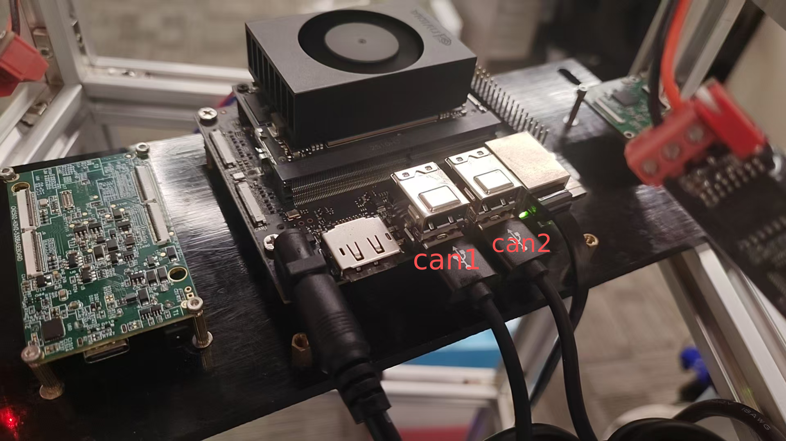
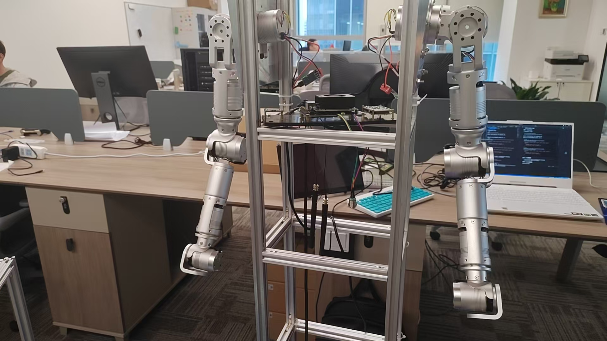
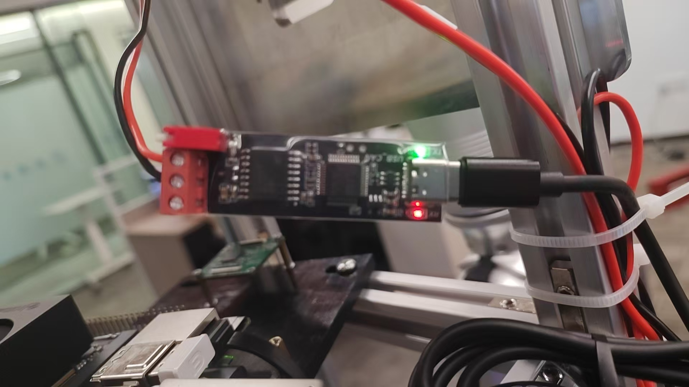
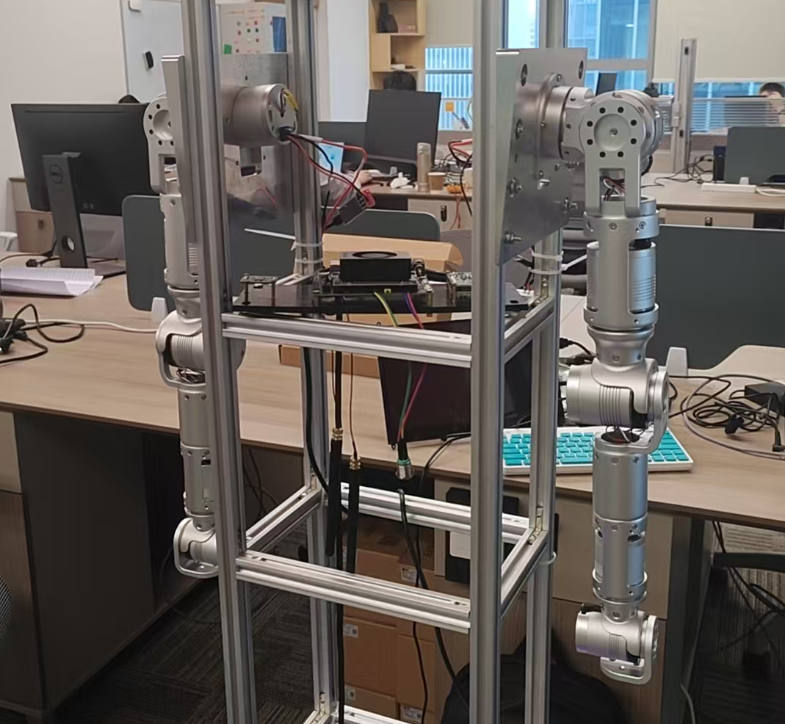
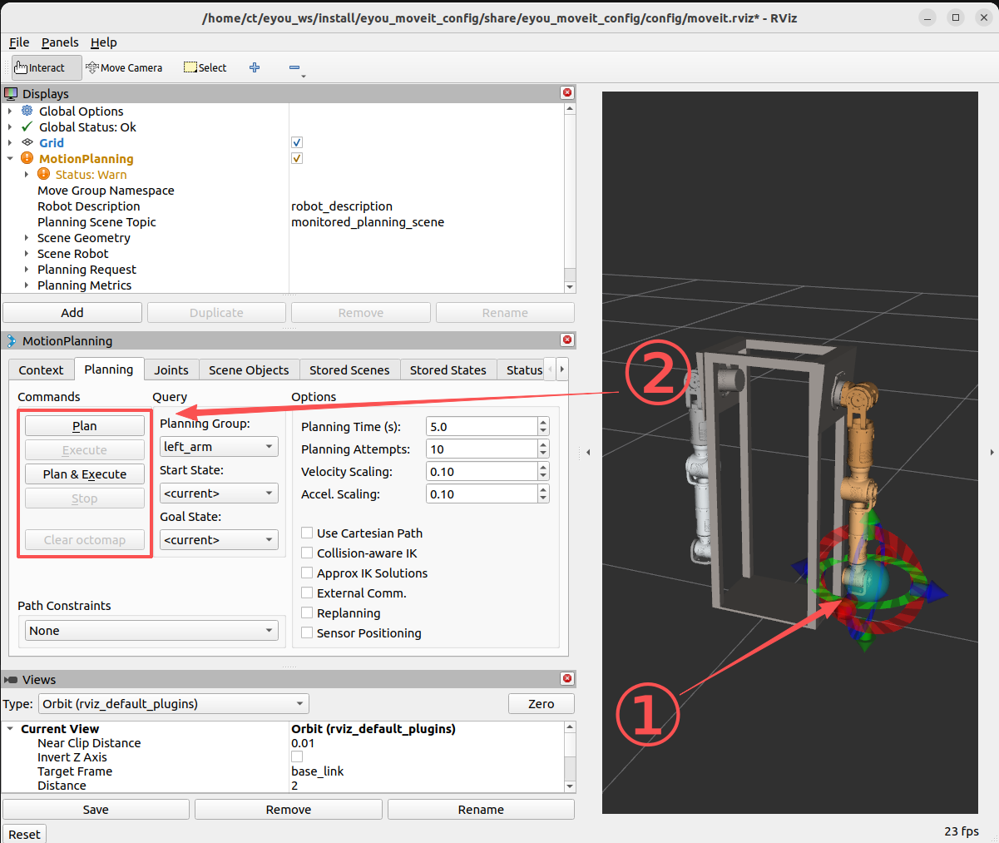

# 说明
本项目是为萃同电机科技有限公司搭建的移动双臂机器人的**机械臂**部分写的说明文档

操作系统是 ubuntu22.04 版本（ros2 humble）
# 机械臂硬件连接
两条机械臂各自分别占用jetson orin nano的一个usb接口

连接时需要确保can1接左臂（2、3、4、5、6、7），can2接右臂（8、9、10、11、12、13）



# 部署驱动
### 安装依赖
前提：用户使用设备已有ros2 humble
```bash
sudo apt update
# 安装ros2_control
sudo apt install ros-${ROS_DISTRO}-ros2-control ros-${ROS_DISTRO}-ros2-controllers ros-${ROS_DISTRO}-controller-manager
# 安装moveit
sudo apt install ros-humble-moveit 
sudo apt install ros-humble-moveit-resources-panda-moveit-config
```
### 安装功能包
```bash
# 创建工作空间
mkdir -p ros2_ws/src
cd ros2_ws/src
# 拉取功能包（三个）
git clone https://github.com/wddycn/ct_arms_pkg.git
cd ..
# 编译
colcon build
```
# jetson本机驱动方式（三种）
！！！**需要为jetson连接屏幕、鼠标、键盘**

## 方式一：ros2_control
三个功能包编译完成后，在终端输入

```bash
source ros2_ws/install/setup.bash
ros2 launch eyou_ros2_control eyou_control.launch.py 
```
启动成功后，正常情况下机械臂会在当前（任意）姿态固定并使能（变硬）;



正常情况下 can模块红绿灯闪烁，若没有可尝试重新启动



新建终端，输入以下命令进行机械臂角度控制（角度可更改，单位：rad）
```bash
# 左臂控制
ros2 topic pub --once /left_arm_controller/joint_trajectory trajectory_msgs/msg/JointTrajectory '
{
  "joint_names": ["joint1","joint2","joint3","joint4","joint5","joint6"],
  "points": [
    {
      "positions": [-0.5, 0.1, 0, -0.5, 0, 0],
      "time_from_start": {"sec": 3, "nanosec": 0}
    }
  ]
}'
```
```bash
# 右臂控制
ros2 topic pub --once /right_arm_controller/joint_trajectory trajectory_msgs/msg/JointTrajectory '
{
  "joint_names": ["joint7","joint8","joint9","joint10","joint11","joint12"],
  "points": [
    {
      "positions": [0.5, -0.1, 0, 0.5, 0, 0],
      "time_from_start": {"sec": 3, "nanosec": 0}
    }
  ]
}'
```
**！！！注明，以下姿态为电机默认零位，可通过源码进行更改**

电机逆时针为正旋转


## 方式二：C++源码控制
- src/eyou_ros2_control/c++源码/eyou.h 当中已经封装好了基于can通信的控制函数
- src/eyou_ros2_control/c++源码/eyou.cpp 是一些调用示例
## 方式三：moveit规划控制
编译好功能包之后在终端输入
```bash
source ros2_ws/install/setup.bash
ros2 launch eyou_moveit_config demo.launch.py 
```
正常出现rviz2界面

- 可以通过拖动机械臂末端绿色小球来设置位姿
- 设置好目标位姿之后 点击左侧MotionPlanning面板当中的 **Plan** 按键进行动作规划
- 规划好动作之后点击下方 **Execute** 按键执行动作


# pc远程控制
本方法建立在 ROS 通信机制 + 网络传输层（TCP/UDP）之上

1.将jetson orin nano开机，连接好机器人本身的网线

2.在jetson板子当中的 **~/.bashrc** 文件当中添加以下变量
```bash
export ROS_DOMAIN_ID=42
```

3.同时在自己pc端进行同样的操作，即在pc和jetson上设置同一个 DOMAIN 环境变量

4.将pc连接至机器人本体网络 **MTBSMH-arm**,密码为：12345678

5.在PC终端输入以下命令可启动机械臂
```bash
ssh ct@192.168.80.20
# 输入密码为 ct 后进入机械臂系统
source ros2_ws/install/setup.bash
# 启动机械臂
ros2 launch eyou_ros2_control eyou_control.launch.py 
```
6.控制机械臂可新建终端输入以下命令
```bash
# 左臂控制
ros2 topic pub --once /left_arm_controller/joint_trajectory trajectory_msgs/msg/JointTrajectory '
{
  "joint_names": ["joint1","joint2","joint3","joint4","joint5","joint6"],
  "points": [
    {
      "positions": [-0.5, 0.1, 0, -0.5, 0, 0],
      "time_from_start": {"sec": 3, "nanosec": 0}
    }
  ]
}'
```
```bash
# 右臂控制
ros2 topic pub --once /right_arm_controller/joint_trajectory trajectory_msgs/msg/JointTrajectory '
{
  "joint_names": ["joint7","joint8","joint9","joint10","joint11","joint12"],
  "points": [
    {
      "positions": [0.5, -0.1, 0, 0.5, 0, 0],
      "time_from_start": {"sec": 3, "nanosec": 0}
    }
  ]
}'
```